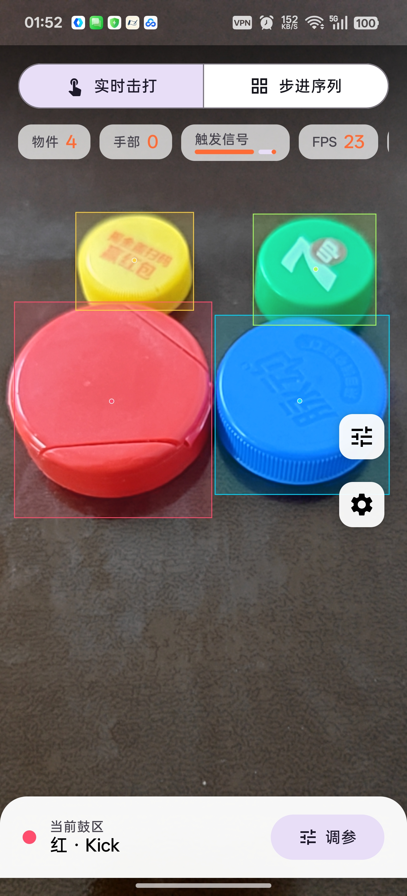
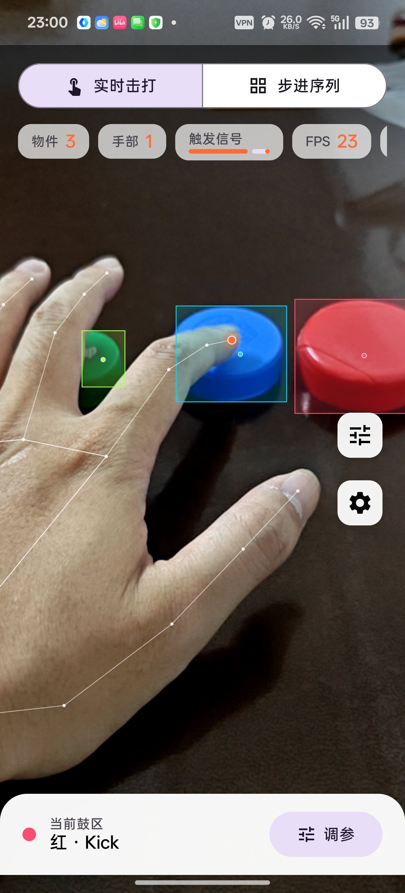
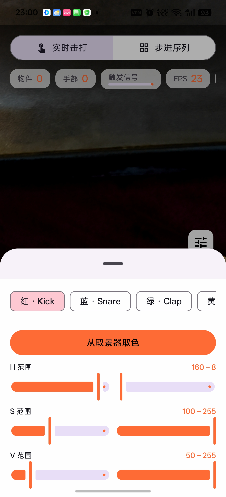
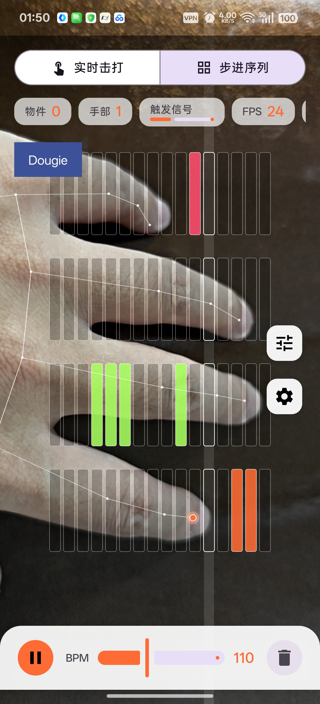
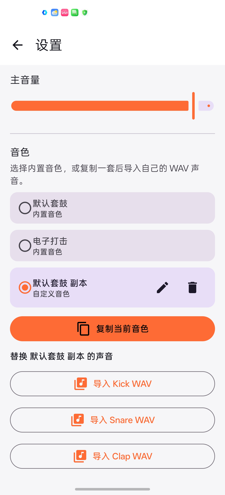
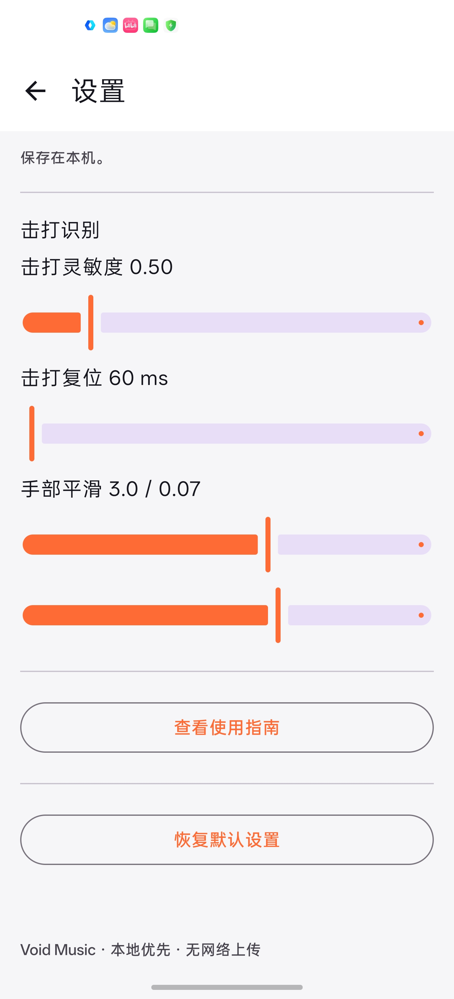

<div align="center">

# Void Music

**让桌面上的彩色物品变成可以真实演奏的鼓垫。**

Void Music 是一款纯本地运行的 Android AR 桌面鼓机。它通过摄像头识别彩色物品与手部动作，实时触发鼓声，也可以在取景画面上编排 4×16 步进节奏。

[](https://github.com/IAmKings/VoidMusic/actions/workflows/android.yml)
[](https://github.com/IAmKings/VoidMusic/releases/tag/v0.1.0-m11)


[下载 v0.1.0-m11](https://github.com/IAmKings/VoidMusic/releases/tag/v0.1.0-m11) · [查看构建状态](https://github.com/IAmKings/VoidMusic/actions)

</div>

## 实机界面

<table>
  <tr>
    <td align="center"><br><sub>彩色物品识别</sub></td>
    <td align="center"><br><sub>实时手部击打</sub></td>
    <td align="center"><br><sub>取色与 HSV 调节</sub></td>
  </tr>
  <tr>
    <td align="center"><br><sub>4×16 AR 步进序列</sub></td>
    <td align="center"><br><sub>音色库与 WAV 导入</sub></td>
    <td align="center"><br><sub>演奏参数设置</sub></td>
  </tr>
</table>

## 功能亮点

- **实时击打**：识别桌面上的红、蓝、绿、黄物品，并将手指击打映射为 Kick、Snare、Clap 和 Tom。
- **手部追踪**：使用 MediaPipe 实时追踪手部关键点；画面平滑与击打判定采用独立数据路径，兼顾视觉稳定和触发速度。
- **AR 步进序列**：在取景画面中校准演奏区域，使用 4×16 网格编排 Kick、Snare、Clap、Hi-Hat，并可调节 BPM、播放或清空序列。
- **识别调参**：支持直接从取景器取色，也可以分别调整 H、S、V 范围，适应不同光照和物品颜色。
- **自定义音色库**：内置两套音色；复制音色后可重命名，并分别为五个鼓垫导入 WAV 文件。
- **低延迟音频**：优先使用 Oboe/AAudio 原生音频引擎，无法启用时自动回退到 SoundPool。
- **设备适配**：提供高、中、低三档性能配置，并在省电或过热场景自动降低分析负载。
- **隐私优先**：不申请网络权限，摄像头画面、识别结果与自定义音色均保存在本机。

## 快速开始

1. 从 [Releases](https://github.com/IAmKings/VoidMusic/releases/tag/v0.1.0-m11) 下载 `arm64-v8a` APK 并完成安装。
2. 首次启动时阅读使用引导并授予摄像头权限；完成后，引导页不会在每次启动时重复出现。
3. 将高饱和度的红、蓝、绿、黄物品放在光线均匀、背景对比明显的桌面上。
4. 进入“实时击打”，等待物品边框和手部骨架稳定出现，然后用指尖快速敲击对应物品。
5. 如果识别不稳定，打开右侧调参面板，选择颜色后使用“从取景器取色”或手动微调 HSV 范围。

### 使用步进序列

1. 切换到“步进序列”，按界面提示依次标定演奏区域的四个角。
2. 在投影出的 4×16 网格中开启需要的节拍；四行分别对应 Kick、Snare、Clap、Hi-Hat。
3. 调整 BPM 后点击播放。播放指示线会随节拍移动，再次点击可暂停，垃圾桶按钮可清空序列。

### 导入自己的鼓声

打开“设置 → 音色”，复制当前音色，然后为 Kick、Snare、Clap、Tom、Hi-Hat 分别选择 WAV 文件。导入文件需要满足：

- PCM 16 位 WAV
- 单声道或双声道
- 8–96 kHz 采样率
- 单文件不超过 10 MiB、时长不超过 5 秒

音频会在导入时完成校验与规范化，并复制到应用私有目录；之后播放不依赖原文件位置或网络。

## 当前版本

当前发布版本为 **v0.1.0-m11**（`versionCode 6`）。该版本已完成真机上的彩色物品识别、连续击打、跨颜色快速切换、扬声器与蓝牙耳机播放，以及步进网格投影验证。

正式稳定版发布前仍计划补齐高、中、低三档设备的 20 分钟持续演奏、温升、后台恢复和完整性能数据验证。因此当前版本适合体验与功能验证，不建议直接用于演出等关键场景。

## 系统要求

- Android 8.0（API 26）及以上
- 后置摄像头
- 当前公开 Release APK 面向 `arm64-v8a` 设备
- 建议使用光线稳定、背景简洁的桌面环境

> 蓝牙音频延迟由手机、系统和耳机共同决定；追求最低演奏延迟时，建议优先使用手机扬声器或有线音频设备。

## 技术架构

> 维护者可阅读 [《Void Music 技术原理》](docs/TECHNICAL_PRINCIPLES.md)，了解颜色分割、手部双路径、击打判定、透视网格、音频回退和生命周期设计。

| 模块 | 技术 |
|---|---|
| UI | Jetpack Compose + Material 3 |
| 相机 | CameraX（Preview + ImageAnalysis） |
| 手部追踪 | MediaPipe Tasks Vision / HandLandmarker |
| 颜色识别 | OpenCV 4.x / HSV 分割与连通区域检测 |
| 音频 | Oboe（AAudio）→ SoundPool 降级 |
| 音色与设置 | Room + DataStore + kotlinx.serialization |
| 构建 | Gradle Kotlin DSL + Version Catalog |

核心实时链路：

```text
CameraX 帧
  ├─ MediaPipe 手部关键点 ── 原始轨迹 ── 击打检测 ── 鼓区仲裁 ── 音频引擎
  │                       └─ 平滑轨迹 ── 手部骨架叠加
  └─ OpenCV HSV 分割 ────── 彩色物品鼓区缓存 ────────┘
```

颜色识别会降低执行频率并缓存鼓区，手部与击打路径继续按实时帧更新，从而减少 OpenCV 对演奏响应的影响。相机预览、识别结果和点击坐标统一映射到屏幕坐标系，设备旋转后也会同步更新。

## 项目结构

```text
app/src/main/java/com/electrodig/voidmusic/
├── audio/          # Oboe JNI、SoundPool、WAV 解码与节拍时钟
├── camera/         # CameraX、帧路由与坐标映射
├── detection/
│   ├── color/      # HSV 颜色分割与取色
│   ├── grid/       # 透视校准与步进序列
│   ├── hand/       # MediaPipe 手部追踪
│   └── hit/        # 击打检测、鼓区追踪与触发仲裁
├── persistence/    # Room 音色库与 DataStore 设置
├── session/        # 会话状态与 ViewModel
└── ui/             # Compose 页面、组件与主题
app/src/main/cpp/   # Oboe 原生音频引擎
app/src/main/assets/ # MediaPipe 模型
app/src/main/res/   # 内置鼓声与 Android 资源
```

## 本地构建

### 环境

- Android Studio 当前稳定版
- JDK 17
- Android SDK 35 / Build Tools 35.0.0
- NDK 27.2.12479018 与 CMake 3.22.1（启用 Oboe 时）

### 常用命令

```bash
# Debug APK
./gradlew assembleDebug

# 包含 Oboe 的 Release APK
./gradlew -PenableNativeBuild=true assembleRelease

# 单元测试与 Lint
./gradlew testDebugUnitTest lintDebug
```

将 `enableNativeBuild` 设为 `false` 可以跳过 JNI/Oboe 构建，应用会使用 SoundPool 降级路径。

## 自动发布

推送与 `versionName` 一致的标签（例如 `v0.1.0-m11`）后，[Android Build & Release](https://github.com/IAmKings/VoidMusic/actions/workflows/android.yml) 会自动执行测试、Lint、原生构建、Release 签名、证书与版本校验，并发布 APK、`SHA256SUMS` 和构建信息。

仓库需要配置以下 GitHub Actions Secrets：

- `ANDROID_RELEASE_KEYSTORE_BASE64`
- `ANDROID_RELEASE_STORE_PASSWORD`
- `ANDROID_RELEASE_KEY_ALIAS`
- `ANDROID_RELEASE_KEY_PASSWORD`

本地签名配置请参考 `keystore.properties.example`。用于公开分发的 keystore 必须长期保留；后续覆盖安装需要使用同一签名证书。

## 隐私

- 不申请 `INTERNET` 权限
- 摄像头画面不会写入磁盘或上传
- 视觉识别、节拍生成和音频播放全部在本机完成
- 导入的 WAV 文件存储在应用私有目录

## License

Proprietary — Electro-Dig.
